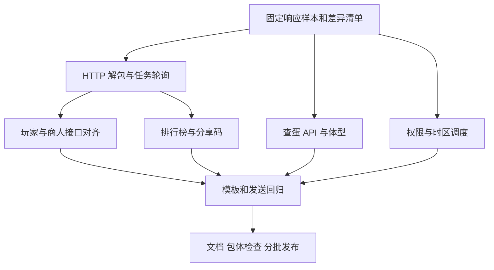

# Koishi 洛克王国插件对齐 AstrBot RoCom 4.1.0 详细规划

编写日期：2026-09-20。文档状态：代码审阅后的实施方案，尚未执行功能开发。

## 1. 对齐目标与审阅基线

目标是把当前 `koishi-plugin-rocom` 的用户可见能力和关键稳定性行为，对齐到本地参考项目 `astrbot_plugin_rocom` 的 **4.1.0**，同时保留 Koishi 插件已有的命令、绑定存储、精灵面板、新旧商人界面和“全部商品”订阅等能力。

| 项目 | 本次审阅基线 |
| --- | --- |
| 目标项目 | 本仓库，`package.json` 版本 `1.0.18` |
| 目标项目 HEAD | `6ef7d85025e5607e6f5022485e1097fcc81b9fe0` |
| 参考项目 | `src/doc/astrbot_plugin_rocom` |
| 参考版本 | `metadata.yaml`：`4.1.0` |
| 参考 HEAD | `f6ecd9ac300d0fd9df6a120096238b4331e01d60` |
| 参考最新提交 | 2026-09-19，发布 4.1.0，适配新版玩家与远行商人接口 |
| 旧迁移记录 | `src/doc/astrbot-rocom-v3-migration.md`，2026-05-06，仅记载 v3 阶段 |

本次结论来自本地更新日志、入口、客户端、业务服务、模板及当前 TypeScript 实现的静态比对。没有执行远端拉取，也没有调用生产 API，因此“最新”仅指上述本地快照。文中的 API 字段以参考代码为证据，实际部署服务的权限与响应仍需要开发阶段使用脱敏样本确认。

本规划使用纠正后的 RoCom 参考目录，不包含 Endfield 的危机合约、抽卡或理智功能。Koishi 的版本号继续独立管理，无需为了对齐把 `1.0.18` 改成 `4.1.0`。

## 2. 结论：需要补齐什么

按实施价值排序：

1. **先修复现有查询链路**：新版玩家嵌套数据、商人实时数据与异步任务、商品映射、默认商店 3009。
2. **再补齐新功能**：异色/炫彩排行榜、阵容分享码解析与历史查询、后端查蛋与体型标记。
3. **统一订阅基础能力**：群管理员/Bot 管理员独立权限开关、官方 QQ 角色适配、时区、抖动重试与卸载清理。
4. **补齐展示和交付**：公告图片、低带宽渲染参数、字体可选外置、帮助与文档。

判断完成不能只看文件或接口方法存在，必须检查“命令入口 → 请求 → 解包 → 数据转换 → 渲染/文字 → 发送 → 失败处理”整条链路。

### 2.1 从 v3 到 v4.1 的完整差异清单

状态定义：“已有”表示找到相关实现，仍需回归验收；“部分”表示功能或可靠性行为不完整；“缺失”表示未发现对应调用链；“可选”表示框架差异下可独立安排。

| 上游版本 | 更新内容 | 当前代码状态 | 对齐动作 |
| --- | --- | --- | --- |
| 3.0.0 | 家园概览、作物图标、菜园/灵感首个与全部提醒 | 已有 | 回归 `query.ts` 与 `HomeSubscriptionManager`，不重复移植 |
| 3.1.0 | QQ 小写别名、`yxsr`、当天其他轮次商品、抖动重试、昵称/@提醒 | 部分 | QQ 小写别名、`yxsr`、今日商品及部分抖动已有；家园提醒仍显示 UID 且没有 @；补昵称/@、空结果重试及对称抖动 |
| 3.1.1 | 当前商品价格和限购、商人图体积优化 | 已有旧接口适配 | 保留 `random_goods` 逻辑，并支持新价格结构和 `limit_buy_num` |
| 3.2.0 | 公告查询/订阅、名称查蛋后端优先、家园异步轮询 | 部分 | 文本公告已有；名称查蛋仍使用 Wiki；家园轮询已有但 Token 省略 UID 路径待补 |
| 3.3.0 | 活动日历、Token 可省略 UID、公告图片重构 | 部分 | 日历已有；玩家命令必填 UID，客户端未透传 Token；公告缺模板与图片调用 |
| 3.4.0 | 生蛋订阅、预计生蛋时间、异色、重载任务清理 | 主体已有，生命周期待补 | 生蛋命令已注册；对已有状态判定回归；清理裸 `setTimeout`，防止轮询重叠 |
| 3.4.1 | 异色/异色炫彩/炫彩图标、JPEG | 已有相关能力 | 用三种变体样本回归图片；维持当前 JPEG 发送 |
| 3.5.0 | 字体外置、双源下载、文件头校验 | 缺失，可独立发布 | 当前仍随包带字体；按第 12 节设计可选外置，不套用 AstrBot 16MB 限制 |
| 3.6.0 | Wiki 目录/全局检索、图鉴下载与别名、Wiki 尺寸反查 | 已有 | `wiki-service.ts`、`atlas-service.ts` 等已实现；修正文档仍写“暂时关闭” |
| 3.6.1 | 家园详情批量/单只、`target_uin/pet_gid/npc_id` | 已有 | 保留 `ingamePetData`、面板缓存与 `pet-data-service.ts` |
| 3.7.0 | 家园详情体型、分贝、去除调试展示 | 已有 | 体型阈值逻辑可抽取复用给查蛋，避免 g/kg 混用 |
| 3.7.1 | 长图截取、图片等待上限 | 部分已有 | 当前有图片等待限时；继续补整个渲染过程超时、字体等待上限 |
| 3.7.2 | 低带宽隐藏技能图 | 已有 | 保留 `lowBandwidthMode` |
| 3.7.3 | 超时释放资源，低带宽降低倍率/质量/等待 | 部分 | 当前 `finally` 关闭 page；缺按低带宽选择截图参数；修补创建临时目录异常时的 page 清理 |
| 3.7.5 | 视口变化后重新测量居中模板 | 已有 | `render.ts` 已重新测量；新模板加入回归 |
| 3.8.0 | `/egg/pet-groups`、`/egg/group-pets`、`/egg/search`、查蛋体型 | 部分/缺失 | 前两个客户端方法已有但命令未用；新增尺寸 API 与结果转换、图片/文字体型标记 |
| 3.9.0 | 两类排行榜、阵容分享码解析/记录、轻量模板 | 缺失 | 新建独立命令和纯数据服务，接入 3 条接口 |
| 3.9.1 | 商人可配置时区与默认 UTC+8 兜底 | 部分 | 商品与轮次已用上海时区；指定时间调度仍用本地时区；补统一时钟 |
| 4.0.0 | 官方 QQ 群角色、Bot 管理员兼容、双权限开关 | 缺失 | 当前群订阅主要检查 `adminUserIds`；新增统一权限服务和平台适配层 |
| 4.1.0 | 玩家搜索/名片嵌套响应、收集数、相对地址 | 缺失 | 改通用轮询、增加名片客户端方法、统一玩家转换器 |
| 4.1.0 | 实时商人优先、`goods_mapping`、异步结果、旧接口兜底 | 缺失 | 当前 `getMerchantInfo` 只查旧接口；商店提交任务后也未轮询 |
| 4.1.0 | 商店默认 ID 3009、旧 rows 兼容 | 缺失 | 当前 `.商店 <shopId:string>` 必填；改为可选并保留旧转换 |

### 2.2 当前必须保留的能力

- `role-token.ts` 数据库凭证与 `UserManager` JSON 绑定并存的现有结构，不移植 Python 的用户存储格式。
- Koishi 的 UID 绑定、刷新面板、精灵面板、图鉴和查蛋配种命令。
- `merchantUiStyle` 新/旧界面，`今日远行商人`，包含匹配与“全部商品”订阅。
- `send-image.ts` 图片失败文字回退、PNG 压缩和 `subscription-send.ts` 主动发送封装。
- 用户现有订阅和命令别名；配置增加字段时提供兼容默认值。

`src/commands/community.ts` 已有换蛋社区处理函数，但当前入口没有注册该模块。它不是这次上游新增的“阵容码”或“排行榜”；本次不顺便启用社区发帖或扩大功能范围。

## 3. 实施结构与文件落点

继续采用当前 TypeScript + Koishi + art-template + Puppeteer，不引入 AstrBot、Python 或 Playwright 运行依赖。上游 HTML 使用的模板语法可复用，但要适配资源路径、字体、页脚和截图根节点。

```text
src/
  client.ts                        修改：新 API、响应解包、通用任务轮询
  index.ts                         修改：配置、依赖、命令注册、菜单
  types.ts                         修改：配置类型、依赖类型
  user.ts                          按需扩展：订阅 bot 标识与发送状态
  player-service.ts                新增：玩家搜索/名片/旧 rows 转统一模型
  merchant-service.ts              新增：新旧商品转换，复用当前 UI
  ranking-service.ts               新增：排行参数、模型、文字
  share-code-service.ts            新增：分享码提取、记录转换、文字
  permissions.ts                  新增：统一订阅权限策略
  merchant-clock.ts               新增：指定时区的轮次/日期/调度
  subscription-runner.ts           新增：可取消调度、互斥、重试
  announcement-service.ts          新增：公告列表/正文展示模型
  font-assets.ts                   可选新增：外置字体下载与缓存
  egg-service.ts                   修改：Egg API 转换、统一体型标记
  pet-data-service.ts              修改：复用体型纯函数
  render.ts                       修改：新根节点、渲染预算与低带宽参数
  commands/
    query.ts                       修改：玩家、商店入口及旧行为兼容
    merchant.ts                    修改：数据服务、时钟、权限、调度
    egg.ts                         修改：API 优先链路
    tools.ts                       修改：公告图片与订阅权限
    ranking.ts                     新增：两类排行榜
    share-code.ts                  新增：阵容码命令组
  render-templates/
    pet-ranking/                   新增：index.html、style.css
    share-code-team/               新增：index.html、style.css
    announcement/                  新增：列表、详情及样式
```

新增文件名和下文标注“拟新增”的函数都属于设计，不表示仓库已存在。代码示例是可落地的核心片段，并非完整补丁；实现时需补齐 DTO 校验、导入、调用者与错误处理后再运行类型检查。现有函数名与签名以本次基线为准。



## 4. P0：请求层、嵌套结果与异步任务

### 4.1 已定位的问题

当前 `RocomClient.get()` 直接返回 `resp.data`，`requestWithStatus()` 也解包 `data`，没有保留同层 `goods_mapping`。上游在普通请求和任务结果两处都将它复制为 `_goods_mapping`；只修改商品渲染会拿不到名称/图标。

`isCompletedGatewayPayload()` 仅识别 `rows/home_info/source/npc_pets/npc_pet/title`，没有 `player_info/player_card_brief_info/goods/shop`。`ingamePlayerSearch()` 还有独立的 8 次轮询，见到 HTTP 200 即返回，未完整判定任务状态；`ingameMerchantInfo()` 仅返回首次请求数据。

另外，Koishi HTTP 的普通调用与返回完整响应的调用形态要依据已安装服务确认。实施时应使用该版本支持的 `ctx.http.axios()` 等完整响应入口获取 `status/data`，不能靠 `?? 200` 推断真实 HTTP 状态。首次任务、轮询任务和普通业务 envelope 必须分别建立测试样本。

### 4.2 实施顺序

1. 定义 HTTP envelope、任务 envelope、业务 payload 的边界；保持现有非 ingame 接口返回习惯。
2. 每剥离一层 `data/result` 时继承 `goods_mapping`，直到得到业务对象。
3. 先检查任务 `failed/error/timeout/cancelled`，再判定完成结果；排队中的 `source/title` 不能被误当成成功数据。
4. 同步结果、HTTP 202、HTTP 200 + queued、completed + result 使用同一解析器。
5. 玩家搜索、名片、家园、精灵数据和实时商人统一复用 `pollIngameTask`；删除玩家短轮询分支。
6. 透传 `{ fwToken, userIdentifier }` 到提交和每次轮询，保留当前 API Key 授权策略；有指定 UID 不自动替换成主账号 UID。
7. 提交/轮询超时、无 task_id、失败任务均返回明确错误。将整体截止时间限制传入请求，避免最后一次请求无限延长总预算。
8. 引入取消信号或等效的实例停用标记，插件卸载后停止下一次请求和发送。

推荐解包纯函数：

```ts
// 拟新增在请求辅助模块；只在明确的 envelope 层调用。
type JsonObject = Record<string, unknown>
const isObject = (v: unknown): v is JsonObject =>
  v !== null && typeof v === 'object' && !Array.isArray(v)

export function inheritGoodsMapping(parent: JsonObject, child: JsonObject) {
  const mapping = child._goods_mapping ?? child.goods_mapping
    ?? parent._goods_mapping ?? parent.goods_mapping
  return mapping === undefined ? { ...child }
    : { ...child, _goods_mapping: mapping }
}

export function unwrapTaskPayload(input: unknown): JsonObject | null {
  if (!isObject(input)) return null
  let value = input
  // 有界拆解任务壳；业务对象中名为 data 的字段不能无条件拆。
  for (let depth = 0; depth < 4; depth++) {
    const state = String(value.status ?? '').toLowerCase()
    if (['failed', 'error', 'timeout', 'cancelled', 'canceled'].includes(state)) {
      throw new Error(String(value.error ?? value.message ?? '任务失败'))
    }
    if (['queued', 'pending', 'running', 'processing', 'accepted'].includes(state)) {
      return null
    }
    if (Array.isArray(value.rows) || isObject(value.player_info)
      || isObject(value.player_card_brief_info) || Array.isArray(value.goods)
      || isObject(value.shop) || isObject(value.home_info)
      || Array.isArray(value.npc_pets) || isObject(value.npc_pet)) return value
    const nested = isObject(value.result) ? value.result
      : isObject(value.data) ? value.data : null
    if (!nested) return null
    value = inheritGoodsMapping(value, nested)
  }
  return null
}
```

这里的 `null` 仅表示“没有已识别的完成业务结果”。调用者还要结合 HTTP 状态、task_id 和终态决定继续轮询、兼容旧结果或报告协议错误，不能把 completed + 无结果无限重试。

### 4.3 验收

- 同步新结果、旧 rows、202 后成功、200 queued 后成功、任务失败、超时、取消、缺 task_id 均有固定输入和预期。
- `goods_mapping` 出现在 HTTP 根层、任务根层或业务层，最终名称和图标都能解析。
- 多个并发请求的错误互不污染。当前 `lastError` 是客户端共享字段，新服务宜返回 `{ ok, data/error }` 的逐请求结果；过渡期不要用并发结束后的共享 `getLastError()` 决定某个请求的兜底理由。

## 5. P0：玩家搜索、名片与商店 3009

### 5.1 玩家数据协议与转换

上游证据：`main.py` 的 `_player_rows_from_formatted_payload()`、`_parse_ingame_player_payload()`，以及 `core/client.py` 的 `ingame_player_search/ingame_player_card`。

| 新字段位置 | 目标展示 |
| --- | --- |
| `player_info.name/level/signature/online` | 昵称、等级、签名、在线状态 |
| `player_info.home_info` | 家园名、家园等级、房间等级、舒适度 |
| `player_info.visit_info.visitor_num` | 访客数量 |
| `player_card_brief_info.card_signature` | 名片签名 |
| `player_card_brief_info.card_pet_info.collected_shining_pet_count` | 异色收集数 |
| `player_card_brief_info.card_pet_info.collected_glass_pet_count` | 炫彩收集数 |
| `player_card_brief_info.business_card_info.cur_card_url` | 名片图，转换相对资源地址 |
| `player_card_brief_info.card_appearance_info.card_skin_selected` | 名片皮肤 |
| `rows[]` | 旧版返回，继续兼容 |

新增 `player-service.ts`，将新数据转成当前 `IngamePlayerRow[]` 或新的统一模型，再供玩家图和个人档案共同使用。不要在 `.玩家` 修一份、`.档案` 留一份旧解析。

```ts
// 核心片段：完整实现应覆盖上表和上游其他基础字段。
export function playerRows(payload: any, uid: string) {
  if (Array.isArray(payload?.rows) && payload.rows.length) return payload.rows
  const p = payload?.player_info ?? {}
  const c = payload?.player_card_brief_info ?? {}
  const stats = c.card_pet_info ?? {}
  const fields: Array<[string, string, unknown]> = [
    ['uin', 'UID', p.uin ?? uid],
    ['name', '昵称', p.name],
    ['level', '等级', p.level],
    ['online', '在线状态', p.online ?? payload?.online],
    ['signature', '个性签名', p.signature ?? c.card_signature],
    ['home_name', '家园名称', p.home_info?.home_name],
    ['home_level', '家园等级', p.home_info?.home_level],
    ['collected_shining_pet_count', '异色收集', stats.collected_shining_pet_count],
    ['collected_glass_pet_count', '炫彩收集', stats.collected_glass_pet_count],
    ['card_bussiness_card_url', '名片图片', c.business_card_info?.cur_card_url],
  ]
  return fields.filter(([, , v]) => v !== undefined && v !== null)
    .map(([field, label, value]) => ({ field, label, value }))
}

export function resourceUrl(value: unknown, apiBaseUrl: string): string {
  if (typeof value !== 'string' || !value.trim()) return ''
  try {
    const url = new URL(value.trim(), apiBaseUrl.replace(/\/$/, '') + '/')
    return ['https:', 'http:'].includes(url.protocol) ? url.href : ''
  } catch { return '' }
}
```

字段拼写 `card_bussiness_card_url` 来自上游兼容字段，不能自行改名导致旧模板取不到。值为 `0/false` 需要保留，不能用 `value || ''` 清空。

### 5.2 命令和客户端步骤

1. `.玩家 <uid:string>` 改为 `.玩家 [uid:string]`；优先显式 UID，再主绑定 UID，再有 Token 时按后端规则省略 UID；没有 UID/Token 则提示绑定或输入 UID。
2. `ingamePlayerSearch` 增加可选授权上下文和轮询参数；新增 `ingamePlayerCard`，请求 `POST/GET /api/v1/games/rocom/ingame/player/card`，参数含 `source: 'friend'`、`wait_ms`。
3. `.玩家` 以搜索结果为主；需要补收集数/名片时按需查 card。card 失败保留基础信息，不让整张玩家图失败。
4. 对显式 UID 与名片/搜索返回 UID 做一致性检查，不合并两个角色的数据。
5. 家园接口同时支持“有 Token、无显式 UID”的路径；从 `getPrimaryToken(deps, userId)` 取凭证，不从 `Binding` 读取不存在的 `framework_token`。
6. `.档案` 当前使用 `ingamePlayerSearch` 获取扩展信息，切换到同一转换器；保留档案其他接口。

名片独立命令可作为后续增强；上游本次主要对齐的是接口能力，不应凭客户端方法存在就声称参考项目新增了独立命令。

### 5.3 商店默认值与输出

把 `.商店 <shopId:string>` 改为 `.商店 [shopId:string]`，缺省使用字符串 `'3009'`。商店查询复用第 6 节实时接口及转换器，兼容 `goods/shop/meta` 与旧 `rows`。

```ts
// 替换 query.ts 原商店注册，buildShopView 为拟新增转换函数。
ctx.command('洛克').subcommand('.商店 [shopId:string]', '查询商店商品')
  .alias('洛克商店')
  .action(async ({ session }, shopId = '3009') => {
    if (!/^\d+$/.test(shopId)) return '商店 ID 必须是数字。'
    const payload = await client.ingameMerchantInfo(ctx, shopId)
    if (payload === null) return `商店查询失败：${client.getLastErrorBrief()}`
    // buildShopView 应返回图片与文字共用的商品数据。
    const view = buildShopView(payload, client.wikiAssetBaseUrl)
    const image = await renderer.renderHtml(ctx, 'ingame-shop', view)
    await sendImageWithFallback(session, image, view.fallbackText, 'shop', config)
  })
```

验收：显式 UID、默认绑定、仅 Token、旧 rows、新嵌套对象、零收集、名片失败、相对地址、商店不填/自定义/空商品均正确。

## 6. P0：实时远行商人及新旧数据兼容

### 6.1 请求顺序

1. 远行商人优先请求 `POST /api/v1/games/rocom/ingame/merchant/info`，`wait_ms=5000`，未指定商店时允许不传 `shop_id`。
2. 根据已验证的后端兼容行为尝试 GET；202 或 200 带 task_id 进入统一轮询。
3. 新接口失败或得到无法识别的协议结构，再调用旧 `GET /api/v1/games/rocom/merchant/info`。旧请求继续保留当前 `refresh` 和 `random_goods=all` 参数。
4. **成功的 `goods: []` 是空商品结果，不等于接口故障。** 不因空列表回退并展示旧缓存为“实时在售”。
5. 返回数据附加客户端来源标记，日志区分 live/legacy，不把客户端标记作为远端必填字段。

### 6.2 商品统一模型

```ts
export interface MerchantItem {
  id: string
  parentId?: string
  name: string
  icon: string
  price: number | null
  limit: number | null
  startsAt: number | null // 毫秒
  endsAt: number | null   // 毫秒
  active: boolean
  source: 'live' | 'legacy'
}

const numberOrNull = (v: unknown): number | null => {
  if (v === undefined || v === null || v === '') return null
  const n = Number(v)
  return Number.isFinite(n) ? n : null
}

export function livePrice(value: any): number | null {
  const selected = value && typeof value === 'object'
    ? value.real ?? value.origin : value
  return numberOrNull(selected && typeof selected === 'object'
    ? selected.amount : selected)
}
```

实现 `normalizeLiveMerchant()`：

- 将 `_goods_mapping/goods_mapping` 按 `String(goods_id)` 建 Map，上游当前处理的 mapping 是数组。
- `goods[]` 按 goods_id 补齐 `goods_name` 和实际返回的图标字段；字段缺失显示“商品 ID”，图标使用本地已有资源。
- 递归 `sub_goods[]`，记录父商品，按“商品 ID + 时间窗口 + 父商品”去重；不要用名称去重丢掉不同限购项。
- 价格使用上面的 `??` 链，保留免费商品 0；限购读取 `limit_buy_num`；截止时间读取 `disable_time`，按已确认单位转换。
- 起止时间缺失显示“时间未知”，不从请求时间虚构上架时间。不具备历史数据时，今日其他轮次区域保持空或明确未提供。
- 秒/毫秒/零值各建样本；是否将零时间视为无截止，依据接口字段语义确认。

实现 `normalizeLegacyMerchant()`：复用现有 `merchantActivities/merchant_activities`、products/get_props/get_extra_props/get_pets 的合并，以及 `random_goods` 价格和限购映射。

统一模型转回新旧商人模板使用的 `products/items/history_groups`，避免直接覆盖当前界面。订阅关键词也必须使用同一份统一模型中的在售商品，防止“图片看得到、订阅匹配不到”。

### 6.3 订阅连带调整

- 无订阅时先返回，不调用商人接口也不截图。
- 一次检查只查询一次、最多渲染一次，各订阅复用图片。
- 空商品不更新去重状态，进入有上限的空结果重试；查询失败与空结果分开统计。
- 成功送达后更新 `last_push_round/last_matched_items`；失败保留待发送状态。
- 继续保留“全部商品”每轮一次、关键词按包含关系匹配的当前功能。

验收至少包含同步/异步 goods、丢映射、sub_goods、免费商品、限购 0、过期商品、新接口失败回退、成功空列表、两种界面、两种订阅模式、发送失败重试。

## 7. P1：异色与炫彩排行榜

### 7.1 功能与 API

对外命令：`异色排行榜 [UID] [数量]`、`炫彩排行榜 [UID] [数量]`；保留上游别名 `异色榜/炫彩榜/洛克异色排行榜/洛克炫彩排行榜`，可另加 Koishi 点式别名。

接口：`GET /api/v1/games/rocom/ingame/player/card/pet-stats/rankings/{shining|glass}`。

参数 `limit`、`resolve_names=1`，可选 `uid`。上游客户端允许 1–100，但命令明确限制 1–50，本项目用户入口也采用 **1–50，默认 10**。此功能不要求游戏登录，但后端仍可能要求 API Key。

单参数 1–50 视为数量；其他纯数字视为 UID；两参数分别为 UID/数量。无 UID 时尝试本地主绑定，未绑定仍可查公共榜。UID 始终以字符串传递，不转成 JS Number。

```ts
// 拟新增在 ranking-service.ts，可独立测试。
export function parseRankingArgs(text: string, primaryUid = '') {
  const parts = text.trim().split(/\s+/).filter(Boolean)
  if (parts.length > 2) throw new Error('用法：排行榜 [UID] [数量]')
  let uid = ''
  let limit = 10
  if (parts.length === 1) {
    const value = parts[0]
    if (/^\d+$/.test(value) && Number(value) >= 1 && Number(value) <= 50) {
      limit = Number(value)
    } else uid = value
  } else if (parts.length === 2) {
    uid = parts[0]
    if (!/^\d+$/.test(parts[1])) throw new Error('数量必须是 1–50 的整数')
    limit = Number(parts[1])
  }
  if (uid && !/^\d+$/.test(uid)) throw new Error('UID 只能包含数字')
  if (!Number.isInteger(limit) || limit < 1 || limit > 50) {
    throw new Error('数量必须是 1–50 的整数')
  }
  return { uid: uid || primaryUid, limit }
}
```

### 7.2 客户端与业务实现

```ts
// 新增在 RocomClient 类内部，复用现有私有请求方法。
async getPetCollectionRanking(
  ctx: Context, rankType: 'shining' | 'glass', limit = 10, uid = '',
) {
  if (!['shining', 'glass'].includes(rankType)) throw new Error('无效榜单类型')
  if (!Number.isInteger(limit) || limit < 1 || limit > 50) throw new Error('无效数量')
  return this.get(ctx,
    `/api/v1/games/rocom/ingame/player/card/pet-stats/rankings/${rankType}`,
    this.wegameHeaders(),
    { limit, resolve_names: '1', ...(uid ? { uid } : {}) },
  )
}
```

`ranking-service.ts` 对齐 `core/ranking_service.py`：

- 输入读取 `total/items/current`；名次使用服务端 `rank`，不能用本页索引重算。
- shining 主数量为 `collected_shining_pet_count`，glass 主数量为 `collected_glass_pet_count`，另一个作为辅助数量。
- 展示 `player_name/card_signature/sample_count/last_seen_at`。
- `card_icon_selected` 对应 `/api/v1/resources/wiki/assets/profile/avatar/{id}.png`，失败显示本地头像。
- `current` 独立于 top items，目标未上榜要显示“该 UID 暂无记录”，不显示排名 0。
- 显式传他人 UID 时标题用“指定玩家名次”，避免上游“我的名次”文案误导。

命令处理模板：

```ts
// 拟新增 commands/ranking.ts 的主体；转换函数需按上述字段实现并导入。
export function register(deps: PluginDeps) {
  const { ctx, client, userMgr, renderer, config } = deps
  for (const [label, kind] of [['异色', 'shining'], ['炫彩', 'glass']] as const) {
    ctx.command(`${label}排行榜 [args:text]`, `查询${label}收集排行`)
      .alias(`${label}榜`).alias(`洛克${label}排行榜`)
      .action(async ({ session }, args = '') => {
        if (!session) return
        let parsed: { uid: string; limit: number }
        try {
          parsed = parseRankingArgs(args, userMgr.getPrimaryBinding(session.userId)?.role_id ?? '')
        } catch (error) { return (error as Error).message }
        const payload = await client.getPetCollectionRanking(ctx, kind, parsed.limit, parsed.uid)
        if (payload === null) return `排行榜查询失败：${client.getLastErrorBrief()}`
        const data = buildRankingView(payload, kind, client.wikiAssetBaseUrl, parsed.uid)
        const image = await renderer.renderHtml(ctx, 'pet-ranking', data)
        await sendImageWithFallback(session, image, buildRankingText(data), 'ranking', config)
      })
  }
}
```

### 7.3 模板和验收

移植上游 `render/pet-ranking/index.html/style.css` 到 `src/render-templates/pet-ranking`，根节点 `.pet-ranking-page` 加入渲染选择器；页脚改 Koishi，图片失败保留本地底图。50 行按最多 25 行/页拆分或采用经验证的高度上限，发送所有分页，不截断剩余名次。

验收：默认 10、单参数数量、UID+50、非法数量、多余参数、未绑定、指定 UID 未上榜、仅 current、空榜、头像失败、图片发送失败、排名含并列值。

## 8. P1：阵容分享码解析与历史查询

### 8.1 与现有阵容的边界

现有 `查看阵容 <lineupId>` 查询的是登录后的阵容推荐详情。新功能处理原始分享码或带 `shareData` 的链接，使用另一组接口，不能改写原命令。

新增：

- `阵容码 解析 <分享码/链接>`：调用解析 API，无需游戏绑定。
- `阵容码 查询 <分享码>`：先查记录，没有记录时提示先解析。
- 可增加 `阵容码解析`、`阵容码查询` 别名，菜单示例使用用户实际可发送的形式。

API 合同：

| 方法/路径 | 参数 | 结果 |
| --- | --- | --- |
| POST `/api/v1/games/rocom/tools/share-code/parse` | JSON `{ share_code }`，用户标识头 | `teams/mode/magic/version/sprite_count/share_code` |
| GET `/api/v1/games/rocom/tools/share-code/records` | `share_code` 或 `hash`，`page_no/page_size`；客户端可支持 `mode_id/magic_id` | `items[]`，记录内含解析对象及计数时间 |

### 8.2 提取分享码

本地只提取和解码字符串，不访问用户提供的链接。兼容 `shareData/share_data/share_code`、query/hash 参数和两层百分号编码；保留原始 `+`。不能直接用表单参数解码把 Base64 中的 `+` 变为空格。

```ts
export function extractShareCode(input: string): string {
  const raw = input.trim().replace(/^[`"']+|[`"']+$/g, '')
  if (!raw) return ''
  const match = /(?:[?&#]|^)share(?:Data|_data|_code)=([^&#\s]+)/i.exec(raw)
  if (!match) {
    if (/^https?:\/\//i.test(raw)) throw new Error('链接中没有分享码参数')
    return raw
  }
  let value = match[1]
  for (let i = 0; i < 2; i++) {
    let decoded: string
    try { decoded = decodeURIComponent(value) }
    catch { throw new Error('分享码链接的编码不完整') }
    if (decoded === value) break
    value = decoded
  }
  return value.trim().replace(/^[`"']+|[`"']+$/g, '')
}
```

设置合理输入长度上限，例如先采用 16 KiB 并用真实合法样本确认；不要通过正则删掉 `+ / =` 等可能属于分享码的字符。

### 8.3 记录解包、渲染和请求步骤

```ts
// share-code-service.ts：避免对已存解析对象重复发 POST。
export function parsedRecord(record: any): any | null {
  for (const candidate of [record?.share_code, record?.parsed, record]) {
    if (candidate && typeof candidate === 'object' && Array.isArray(candidate.teams)) {
      return candidate
    }
  }
  return null
}
```

1. 在 `RocomClient` 增加 `parseShareCode(ctx, code, userIdentifier)` 和 `getShareCodeRecords(ctx, options, userIdentifier)`，与现有 `post/get/wegameHeaders` 约定一致。
2. 解析命令提取 code 后发 POST；查询命令发 GET，使用 `page_no=1/page_size=1`，取 `items[0]`。
3. 记录中已有 teams 就本地渲染；缺解析对象时，可按上游行为重新调用 parse 补齐，并明确这会增加后端解析记录/计数。不能把查询计数承诺成绝对只读。
4. 转换 `teams[]`：按 slot 排序，精灵、血脉、性格、`ivs_detail`、skills 均为空值友好。
5. 天赋显示 3 槽、技能显示 4 槽，缺项补“未配置”。数据层保留完整原始内容，异常多槽记录日志后按模板能力展示。
6. 精灵图 `/api/v1/resources/wiki/assets/pets/{id}/icon.png`；技能图 `/api/v1/resources/wiki/assets/skills/{id}.png`；其余资源用第 5 节 URL 转换器。
7. magic 有 ID 没有名字时显示“魔法 ID”。历史信息显示 `parse_count/first_seen_at/last_seen_at/share_code_hash`；时间含时区解析后再格式化。
8. 图片和文字都展示阵容关键信息；文字至少包括槽位、精灵、血脉、性格、天赋和技能，避免图片失败后丢掉新功能内容。

Koishi 命令组采用空格子命令语义，并在实际解析器回归：

```ts
const command = ctx.command('阵容码', '阵容分享码工具')
command.subcommand('解析 <input:text>', '解析分享码或链接').action(parseAction)
command.subcommand('查询 <input:text>', '查询分享码历史').action(queryAction)
// parseAction/queryAction 为拟新增 action，需实现上面的完整调用流程。
```

移植 `render/share-code-team`，根节点 `.share-code-page`。原模板有 `{{_res_path}}logo.png`，当前 postbuild 只复制 `render-templates/img/ttf`，因此把该兜底图片改为包内已有的 `img/logo.cVSpb3sL.png`，不能留下发布后必裂的根目录 logo 引用。

验收：原始码、链接、hash、二次编码、含 `+`、错误编码、无参数链接、非法码、未登录、未记录、嵌套记录、只有 parsed、缺天赋/技能、缺魔法名、远程图失败、文字回退。

## 9. P1：后端查蛋模块与大小块头

### 9.1 当前差距与 API 优先级

当前 `client.ts` 已有 `getEggGroups/getEggPetGroups/getEggGroupPets`，但 `commands/egg.ts` 名称查询仍使用 `listWikiPets/getWikiPet/getWikiPetProfile`，尺寸查询使用 `queryPetSize`。`egg-service.ts` 没有上游 3.8 的 Egg API 专用转换和大小块头展示。

新流程：

- 名称：`egg/pet-groups` → 唯一目标/候选 → `egg/group-pets` → 渲染。仅接口不可用才回退本地 Pets；为照顾现有能力，也可保留 Wiki 作为本地之前的中间回退，但必须标注数据来源。
- 身高+体重：`egg/search` → 失败后 `wiki/pet-size/query` → 失败后本地尺寸引擎。
- 仅身高：继续当前本地能力，除非确认 Egg API 接受省略 weight，不能自行猜测协议。
- 单参数/双参数配种：保留当前规则。上游 3.8 主要改变查蛋，不应强制把配种引擎也改成新的远端依赖。

**成功且 items 为空时显示未匹配，不回退旧数据制造假阳性。** 必须区分 `null`（失败）与 `{ items: [] }`（成功空集）。

### 9.2 实现步骤与字段

1. 新增客户端 `searchEggBySize(ctx, heightMeters, weightKg, pageNo, pageSize, userIdentifier)`，GET `/api/v1/games/rocom/egg/search`，参数名是 `height/weight`，不是 Wiki 接口的 `diameter/weight`。
2. 复用现有输入解析，保留 `heightMeters`；当前本地引擎使用的数值换算不能直接送到新 API。
3. `pet-groups?q=名称&limit=20` 返回候选，根据 id、name、form、完整展示名选择。多个候选先展示，不擅自选第一个。
4. 蛋组 ID 兼容 `group_id/id`；批量 `group-pets` 用 `group_ids` 逗号字符串、`match_mode=any`。
5. 可以与上游一致先请求合并蛋组 `page_size=1` 获取总量，再逐组取展示成员；每组当前页与总量分开呈现，不把 60 条预览说成全量。
6. `EggService` 增加 `buildSearchDataFromEggApi/buildCandidatesFromEggApi`，尺寸转换支持 `height_range_m/cm`、`weight_range_kg/g`、`r_value/range_area`，继续兼容 `items[].pet/egg_size/match`。
7. 源数据标注“后端查蛋 / Wiki 回退 / 本地回退”；统计数量取后端 total，不简单相加多个重叠蛋组的数量。

### 9.3 体型判定代码

抽取统一纯函数到 `pet-size.ts`（拟新增），家园详情和查蛋都先把数据转成相同单位，再调用。规则为体重范围下端 5%/上端 5%，不是“最小值乘 1.05 / 最大值乘 0.95”。

```ts
export function classifyWeight(weightKg: number, minKg: number, maxKg: number) {
  if (![weightKg, minKg, maxKg].every(Number.isFinite) || maxKg <= minKg) return null
  if (weightKg < minKg || weightKg > maxKg) return null
  const span = maxKg - minKg
  const small = minKg + span * 0.05
  const large = maxKg - span * 0.05
  if (weightKg <= small) return { label: '小块头', css: 'size-small', threshold: small }
  if (weightKg >= large) return { label: '大块头', css: 'size-large', threshold: large }
  return null
}
```

图片模板与 `buildSizeSearchText*` 共用函数输出，展示阈值和 kg 单位。比较时使用未四舍五入的数值，显示时再格式化。范围数据缺失不做判断；近似匹配超出合法区间的候选不贴体型标签。若真实数据仅提供取整值，需建立边界容差规则并单独标注，不直接声称精确判定。

验收：`0.18m/1.5kg` 参数原样到 API；cm/g 正确换算；两条 API 依次失败；成功空集不回退；多形态候选；重复蛋组；前/后 5% 边界；无范围/相同上下界/零值/图片与文字一致。

## 10. P1：官方 QQ 与统一订阅权限

### 10.1 策略与配置迁移

上游 4.0 的目标是群主/管理员和 Bot 管理员都可以按开关管理订阅。AstrBot 的 `admins_id/event.is_admin()/qq-botpy` 补丁不能直接复制到 Koishi。

新增 `permissions.ts`，统一远行商人、家园、公告的订阅、取消和管理查看；后台调试、配置同步、批量凭证操作仍沿用 Bot 管理员要求，不能因为本群管理员身份就允许操作全局用户。

推荐使用直观的新配置名，同时在说明中对应上游字段：

| Koishi 拟新增配置 | 对应上游 | 推荐默认与迁移 |
| --- | --- | --- |
| `subscriptionGroupAdminEnabled` | `merchant_group_admin_enabled` | 新安装默认 true；旧安装升级时明确提示原先仅白名单管理员的策略将扩展，可设 false 保持原策略 |
| `subscriptionBotAdminEnabled` | `merchant_bot_admin_enabled` | true，继续承认 `adminUserIds` |
| `subscriptionBotAdminAuthority` | 全局管理员判断的 Koishi 替代 | 4；查询 session.user 的 authority，不能仅凭字段名假定已加载 |
| `merchantTimezone` | `merchant_timezone` | `Asia/Shanghai` |

实现时同步 `index.ts` 的 `Config`、Schema、`types.ts` 的 `PluginConfig`，不要只更新一个接口。现有 `adminUserIds` 继续接受官方 QQ 的实际用户标识；不能把 OpenID 换算成 QQ 号，也不能把不同平台的用户 ID 默认视为同一个主体。

### 10.2 可信角色适配

1. Koishi 标准会话优先取已规范化的 member roles。
2. OneBot 从实际适配器提供的可信 sender.role 取得 `owner/admin/member`。
3. 官方 QQ 从适配器保留的原始 author.member_role 读取。**具体挂载路径要用已安装适配器和脱敏事件确认**，不是把 AstrBot 的 `raw_message` 路径照搬。
4. 如果适配器没有保留角色，可在受支持的成员查询 API 中取得；查询失败按未知角色处理，由白名单/Bot 权限兜底。
5. 数字角色值仅在接口契约确认后映射；消息正文或用户自填名称都不能参与权限判断。

将“读取平台事件”与“决定权限”分开，后者可以写成完整纯函数：

```ts
export interface SubscriptionPermissionInput {
  privateChat: boolean
  privateAllowed: boolean
  groupRole: 'owner' | 'admin' | 'member' | 'unknown'
  groupAdminEnabled: boolean
  botAdminEnabled: boolean
  whitelisted: boolean
  authority: number
  botAdminAuthority: number
}

export function mayManageSubscription(p: SubscriptionPermissionInput): boolean {
  if (p.privateChat) return p.privateAllowed
  if (p.botAdminEnabled
    && (p.whitelisted || p.authority >= p.botAdminAuthority)) return true
  return p.groupAdminEnabled && ['owner', 'admin'].includes(p.groupRole)
}
```

命令注册需要 `.userFields(['authority'])` 或该版本支持的等效方式加载 authority，再构造上述输入。群主/管理员限操作当前群订阅，私聊用户限操作自身订阅。

私聊判定优先使用适配器规范化的 `session.isDirect`。当前多处使用 `!session.guildId`，不能保证适用于所有官方 QQ 会话，应增加平台会话识别适配并以真实群/私聊事件验收。

### 10.3 发送目标

当前 `subscription-send.ts` 按 platform 选第一个 Bot，目标缺失时可能退到全局第一个 Bot。适配多个官方 QQ Bot 时应为新订阅存储 `self_id`，使用 `platform + self_id` 精确找 Bot。

旧订阅缺少 self_id 时，仅在对应平台恰有一个可用 Bot 时自动兼容；多个候选时提示重新订阅，不误发其他 Bot。群的 channel/guild 与私聊 user 分开存取，避免把 OpenID 当成群号。

官方 QQ 的主动发送能力由适配器和平台决定；遇到实际发送失败时记录可操作的错误，保留待重试状态。权限识别通过不代表订阅推送已经通过验收。

验收矩阵：群主、管理员、普通成员、白名单、authority 达标、缺角色、私聊；两个开关的四种组合；OneBot/官方 QQ；单 Bot/多 Bot；新增/取消/查看权限一致。

## 11. P1：商人时区、订阅抖动与任务生命周期

### 11.1 一套时钟覆盖全部路径

已确认 `merchant.ts` 的商品日期与轮次使用 `Asia/Shanghai`，但定时检查使用 `new Date().getHours()`，所以在 UTC 服务器上仍会错时。必须让这些位置共用 `MerchantClock`：

- 当前日期、轮次 ID 和开放状态。
- 商品时间文本、当天其他时段筛选。
- `merchantCheckTimes` 匹配和重试所属轮次。
- 下一轮检查时间、日志时间标签、去重键。

```ts
// merchant-clock.ts 核心结构。默认上海时区失败时固定 +08:00。
export class MerchantClock {
  private formatter: Intl.DateTimeFormat
  private fixedOffset = false
  readonly zone: string

  constructor(requested = 'Asia/Shanghai') {
    let zone = requested
    try {
      new Intl.DateTimeFormat('en-CA', { timeZone: zone }).format(0)
    } catch {
      if (requested === 'Asia/Shanghai') {
        zone = 'UTC'
        this.fixedOffset = true
      } else zone = Intl.DateTimeFormat().resolvedOptions().timeZone || 'UTC'
    }
    this.zone = this.fixedOffset ? 'UTC+08:00' : zone
    this.formatter = new Intl.DateTimeFormat('en-CA', {
      timeZone: zone, hourCycle: 'h23', year: 'numeric', month: '2-digit',
      day: '2-digit', hour: '2-digit', minute: '2-digit', second: '2-digit',
    })
  }

  parts(nowMs = Date.now()) {
    const timestamp = nowMs + (this.fixedOffset ? 8 * 3600_000 : 0)
    const values = Object.fromEntries(this.formatter.formatToParts(timestamp)
      .filter(p => p.type !== 'literal').map(p => [p.type, p.value]))
    return {
      date: `${values.year}-${values.month}-${values.day}`,
      hour: Number(values.hour), minute: Number(values.minute), second: Number(values.second),
    }
  }
}
```

配置非法时记录一次警告和实际生效时区。使用 `hourCycle: 'h23'` 避免某些格式化结果把午夜表示成 24 点。

上述片段提供时间提取，还需要实现“指定时区的下一个检查时刻”。如果支持任意 IANA 时区，不能继续用硬编码 `+08:00` 计算日界，也不能假设每天都是 24 小时；夏令时切换日以真实时间戳转换后的本地日期/时间匹配。可采用短周期扫描目标墙钟分钟并按日期去重，或在引入时区库后计算下一次候选，必须测夏令时跳过/重复时段。

### 11.2 调度策略

保留 `merchantCheckMode=interval/times`：

- interval：按当前配置间隔检查，允许 0–30 秒启动抖动；与“精确时间 ±30 秒”明确区分。
- times：在目标墙钟时刻前计算候选，支持真正的 ±30 秒偏移。等到了目标分钟才调度，无法得到负偏移。
- 可推荐上游默认检查点 `08:01/12:01/16:01/20:01`，但不静默覆盖用户原有时间列表。
- 同一轮空结果最多重试 3 次，基准间隔 4 分钟并加 ±30 秒；切换轮次、卸载或无订阅时终止旧重试。

`checkMerchantSubscriptions()` 返回明确结果，例如 `{ kind: 'empty'|'success'|'error'|'no-subscriptions', ...counts }`，不要根据“推送数为 0”误判为空商品。

### 11.3 防重入、卸载与发送去重

当前 Koishi `ctx.setInterval` 有生命周期管理，但商人抖动使用裸 `setTimeout`。轮询间隔触发的异步检查也可能重叠。

```ts
// subscription-runner.ts，示例展示每个插件实例的互斥和停止标记。
export function createRunner(ctx: Context) {
  const controller = new AbortController()
  let running = false
  ctx.on('dispose', () => controller.abort())
  return async (job: (signal: AbortSignal) => Promise<void>) => {
    if (running || controller.signal.aborted) return
    running = true
    try { await job(controller.signal) }
    finally { running = false }
  }
}
```

所有延迟任务改为 `ctx.setTimeout` 或登记句柄后在 dispose 清理。job 内部每次外部请求后、每次发送前检查 signal；支持取消的 HTTP 调用透传 signal。仅停止计时器而不处理在途请求，还会在重载后出现旧实例发送。

商人、家园、公告分别使用互斥 runner，避免一个家园队列阻塞所有订阅。各功能发送成功后才持久化去重状态；单实例内 runner 可阻止重叠，多进程部署需要数据库租约或唯一发送任务，不能把进程内锁说成跨实例保证。

家园首个/全部提醒还要测试“部分成熟→全成熟→收获重置→再次成熟”和“查询失败期间状态不前移”。同样检查生蛋首次/全部、UID 对应昵称和 @ 用户、旧订阅数据恢复。

### 11.4 家园通知昵称和 @ 的具体补齐

当前 `homeSubscriptionMessage(sub.uid, ...)` 直接使用 UID，检查函数发送的是纯字符串。补齐步骤：

1. 在创建家园订阅时，从当前用户绑定中寻找 role_id 与目标 UID 相同的绑定，把昵称及通知用户标识作为可选字段快照保存。
2. 订阅者指定其他玩家 UID 时，没有证据证明其为绑定所有者，不自动 @ 订阅者冒充该玩家；显示 UID 即可。
3. 旧订阅可以先用 `updated_by` 查其本地绑定；同 UID 无匹配时退回 UID。跨平台身份没有映射时不凭 QQ 数字猜测。
4. 群通知可用 `h.at(notifyUserId)` 加消息文本，私聊不 @；使用 Koishi 消息元素，不能把 `[CQ:at,...]` 字符串硬编码进通用发送器。
5. 不修改订阅 key 或首个/全部状态，避免仅升级昵称就重复推送。

```ts
// 发送前组装片段；notifyUserId/label 来自经校验的绑定与平台映射。
const content = isDirect || !notifyUserId
  ? h.text(messageWithLabel)
  : [h.at(notifyUserId), h.text(`\n${messageWithLabel}`)]
const sent = await sendScheduledMessage(ctx, target, content)
// sent === true 后再推进通知状态。
```

验收：进程时区分别为 UTC/上海/美西时轮次一致；午夜、08:00/12:00/16:00/20:00 边界；自定义时区；空商品三次重试；慢任务不重叠；重载后旧任务不发送；发送失败不写已推送。

## 12. P2：公告图片、渲染预算与字体资源

### 12.1 公告图片补齐

当前 `tools.ts` 的公告列表、最新公告、详情和订阅主要构建文字，`src/render-templates/announcement` 不存在。上游 v3.2/v3.3 的可视化对齐尚未完成，需纳入本轮。

实施步骤：

1. 新建 `announcement-service.ts`，从当前 `buildAnnouncementListText/buildAnnouncementDetailText` 抽出共用字段转换。
2. 对照上游 `main.py` 的公告处理函数以及 `render/announcement` 模板，适配列表 items 与详情包装，保存 ID、标题、分类、发布日期、正文、图片。
3. 新增列表和详情模板，页脚与说明使用 Koishi 命令；根节点 `.announcement-list-page/.announcement-detail-page` 注册到渲染器。
4. 公告命令优先图片，复用现有文字函数作回退；订阅使用 `sendScheduledImageWithFallback`，发送失败不更新公告游标。
5. 正文先解析为受控段落、标题、图片块。默认不原样执行远端 HTML/script；使用需要的标签白名单或转换成纯文本块，链接/图片地址统一规范化。
6. 超长公告按块分页；图片保持宽高比。给单页物理像素设置预算，避免只用 `fullPage` 生成超过浏览器或消息平台能力的大图。

新增转换接口设计：

```ts
export type AnnouncementBlock =
  | { type: 'paragraph'; text: string }
  | { type: 'heading'; text: string }
  | { type: 'image'; url: string; alt: string }

export interface AnnouncementView {
  id: string
  title: string
  publishedAt: string
  blocks: AnnouncementBlock[]
  sourceUrl: string
  fallbackText: string
}
```

验收：列表、纯文本详情、多图详情、超长公告、图片 404、HTML 无效、无正文、图片发送失败及订阅失败后重试。旧文本输出作为最终兜底保留。

### 12.2 渲染预算与低带宽补齐

当前 `render.ts` 有 `page.close()` 的 finally、有远程图片 10 秒等待上限、有居中元素二次测量，但默认倍率 2、JPEG 82 和导航 15 秒固定，字体 `fonts.ready` 没有单独上限；创建 page 后、进入内层 try 前创建临时目录也可能失败。

扩展 `renderHtml(ctx, templateName, data, options?)`，旧调用不改参数仍能工作：

```ts
export interface RenderOptions {
  timeoutMs?: number
  imageWaitMs?: number
  fontWaitMs?: number
  deviceScaleFactor?: number
  jpegQuality?: number
  maxPageHeight?: number
}

// 家园详情低带宽建议初值，需用真实截图校准。
const lowBandwidthOptions: RenderOptions = {
  timeoutMs: 30000, imageWaitMs: 3000, fontWaitMs: 1500,
  deviceScaleFactor: 1, jpegQuality: 65, maxPageHeight: 12000,
}
```

实施要求：

- 新增 `renderTimeout` 配置，整个导航、资源等待、截图共享截止时间；各阶段不得累加到无限长。
- 把 page 创建后的所有操作包进同一 try/finally；临时目录只删除本次创建的目录。
- 超时要主动关闭本次 page，使在途 evaluate/screenshot 结束，单纯 Promise.race 返回不会取消浏览器工作。
- Puppeteer 服务由 Koishi 共享，**只能关闭本次 page，不能关闭共享 browser**。
- 图片等待与字体等待都有上限；低带宽模式降低倍率/质量/等待，并继续禁用技能图。
- 新模板加入根选择器和适合的 viewport；保留居中重测逻辑。
- 超长内容先分页，再截图；不得为了满足高度上限直接裁掉后半内容。

这部分是功能开发计划，本次只写文档，不实际创建额外测试页或浏览器进程。

### 12.3 字体外置与包体

当前 `src/ttf` 五个文件合计约 18.35 MiB。上游把三种字体外置解决 AstrBot 包大小约束；Koishi 没有在本次代码中体现同样的 16MB 限制，建议作为独立优化，避免为对齐版本强行移除离线可用资源。

建议设计 `fontMode: 'bundled'|'download'|'system'`，初期默认 bundled，外置稳定后再评估默认值：

1. 在 `<ctx.baseDir>/data/rocom/fonts` 保存缓存，使用 `path.join`，不写插件安装目录。
2. 用固定字体清单，参考上游 `core/font_assets.py` 的 GitCode 首选和固定 GitHub 提交备用；两个额外本地字体要核对来源及模板用途后决定保留或外置。
3. 下载到同目录唯一临时文件，校验非空、最大大小及字体头 `00 01 00 00/OTTO/wOFF/wOF2`，通过后原子重命名。
4. 对同一个字体做 single-flight，避免多个渲染同时下载；失败回退 bundled 或系统字体。
5. 生成字体 CSS/URL 映射注入模板；CSS 中相对字体路径也需解析，不能仅改 HTML 链接。
6. 插件启动不等待所有字体下载；命令可正常加载，字体下载失败不导致插件启动失败。
7. 真正启用精简发行包时同步 `postbuild` 的复制逻辑和 `files` 白名单，用实际 npm 包检查证明体积下降。

```ts
export function validFontHeader(buffer: Buffer): boolean {
  if (buffer.length < 4) return false
  return ['00010000', '4f54544f', '774f4646', '774f4632']
    .includes(buffer.subarray(0, 4).toString('hex'))
}
```

验收：缓存命中、首源失败次源成功、HTML 错误页、两源失败系统字体、并发初始化、Windows 路径、发布包脱离源码目录仍能渲染。

## 13. 命令、菜单与文档同步

新增模块在 `index.ts` 创建 `deps` 后注册，避免只增加文件没有入口：

```ts
import { register as registerRanking } from './commands/ranking'
import { register as registerShareCode } from './commands/share-code'

// 与现有 registerQuery/registerEgg 等处于同一注册阶段。
registerRanking(deps)
registerShareCode(deps)
```

需要更新的用户内容：

| 文件/内容 | 更新要求 |
| --- | --- |
| `index.ts` 的 `MENU_GROUPS` | 增加异色榜、炫彩榜、阵容码解析/查询；玩家可选 UID、商店默认值写清 |
| `docs/commands.md` Wiki/技能 | 移除“暂时关闭”旧描述，按实际注册和实现列出全局/分类检索 |
| `docs/commands.md` 新功能 | 增加榜单参数消歧、无需游戏登录说明、分享码链接示例和查询记录副作用 |
| `docs/commands.md` 现有遗漏 | 补家园详情、玩家、商店、图鉴下载、精灵图鉴、生蛋订阅、公告订阅与取消 |
| `docs/commands.md` 查蛋 | 写清 Egg API → Wiki → 本地降级、单位与体型标记 |
| `readme.md` 配置 | 补当前未列出的商人 UI/检查模式、公告、家园排队、低带宽及新增配置 |
| `readme.md` 权限 | 说明群管理员与 Bot 管理员开关、官方群 ID、管理员全局指令区别 |
| `src/doc/astrbot-rocom-v3-migration.md` | 保留历史；追加指向本规划/最终验收记录的说明，不把历史结论改成当前事实 |
| 本地更新日志 | 按实际实现日期写 Koishi 的更新，不复制上游发布日期当作本项目发布日期 |

帮助中的前缀以当前 Koishi 命令体系为准；若需要上游 `help_prefix_display`，可新增仅影响菜单展示的配置，不能悄悄改变命令注册前缀。

模板移植保留来源说明与相关许可信息。当前 package.json 的 MIT 声明与 README/参考代码的 AGPL-3.0 描述不一致，发布移植版本前应核对仓库 LICENSE 和代码来源后统一元数据；这属于发布材料核对，不影响先完成技术开发。

## 14. 分阶段排期与进度对齐方法

估算按一名熟悉当前项目的开发者、可取得脱敏 API/会话样本计，单位为工作日。是排期参考，不是实际已投入工时。

| 阶段 | 工作包 | 预计 | 完成门槛 |
| --- | --- | --- | --- |
| M0 | 固定基线、提取样本、建立验收清单 | 0.5–1 天 | 每个新结构有样本；待确认字段有负责人和状态 |
| M1 | 请求解包、通用轮询、玩家/名片、实时商人、商店 3009 | 2–3 天 | v4.1 接口在新旧样本上全部通过，旧查询回归 |
| M2 | 查蛋 API/体型、排行榜、阵容分享码及模板 | 3–4 天 | v3.8/v3.9 所有命令可用，图文降级完整 |
| M3 | 官方 QQ 权限、时区、调度、停止/重试 | 2–3 天 | v4.0/v3.9.1 行为通过会话/时钟/重载验证 |
| M4 | 公告图片、渲染预算、帮助文档、发布包验证 | 2–3 天 | 早期可视化缺口关闭，交付记录完整 |
| M5 可选 | 外置字体和精简发行包 | 1–2 天 | 下载/离线兜底、真实包体对比、字体回归 |

必做合计约 **9.5–14 天**，字体外置另计。适配器缺失角色、后端接口未部署或缺权限会使联调等待增加，不能把这种等待伪报为代码已完成。

建议提交切分：

1. `fix(client): preserve gateway metadata and unify task polling`
2. `fix(query): support nested player data and live merchant responses`
3. `feat(egg): use egg APIs and show size variants`
4. `feat(ranking): add shining and glass leaderboards`
5. `feat(lineup): parse and query team share codes`
6. `feat(subscription): unify roles timezone and managed scheduling`
7. `feat(announcement): add image views and bounded rendering`
8. `docs: update commands config and upstream alignment record`
9. 可选 `perf(assets): support external font cache`

提交顺序表示依赖拆分，不要求一次性大合并。M1 可以先作为修复版本交付，M2/M3 作为功能版本，M4/M5 根据验收分批发布。具体版本号在实施完成时确定，不能在只有计划时写“已支持 4.1 全功能”。

### 14.1 进度台账模板

新增 `docs/upstream-alignment-status.md` 作为实施阶段台账，记录以下列；本次不预填为完成：

| 能力编号 | 上游基线 | 当前状态 | 实现提交 | 样本/测试证据 | 待解决问题 |
| --- | --- | --- | --- | --- | --- |
| API-01 解包/轮询 | f6ecd9a | 待实施 | — | 同步、异步、失败样本 | 核对 HTTP 完整响应 API |
| PLAYER-01 嵌套玩家 | 4.1.0 | 待实施 | — | 搜索/名片/rows | 确认生产字段 |
| MERCHANT-01 实时商人 | 4.1.0 | 待实施 | — | goods+mapping+任务 | 确认禁用时间单位 |
| EGG-01 后端查蛋 | 3.8.0 | 部分接口已有 | — | 三段降级+体型 | 命令尚未接新接口 |
| RANK-01 两类排行榜 | 3.9.0 | 待实施 | — | 参数+空榜+50名 | 确认 API 权限 |
| SHARE-01 分享码 | 3.9.0 | 待实施 | — | 编码+记录+空槽 | 确认记录结构 |
| SUB-01 权限与时钟 | 4.0.0/3.9.1 | 待实施 | — | 适配器事件+时钟 | 官方 QQ 原始字段位置 |
| VIEW-01 公告/渲染 | 3.3/3.7 系列 | 部分已有 | — | 长图+低带宽+释放 | 字体等待预算 |
| ASSET-01 字体 | 3.5.0 | 可选 | — | 下载/包体/离线 | 两个本地字体用途 |

状态统一为“待实施 / 开发中 / 待联调 / 验收通过 / 延后且说明原因”。只有命令、错误分支、渲染/文字和文档一起通过才算该能力对齐。对暂时没有生产环境验证的功能标注“样本验证通过，实服待联调”。

### 14.2 后续跟进上游的固定流程

每次更新参考副本后，对比上一次记录的 commit：先读 CHANGELOG，再读 `core/client.py`、相关业务服务、main.py 命令和模板的 diff。不要只用版本号或文件存在判断进度。

```powershell
# 只读示例：在已认可的参考快照上比较，不自动拉取或覆盖目录。
git -C src/doc/astrbot_plugin_rocom log --oneline f6ecd9a..HEAD
git -C src/doc/astrbot_plugin_rocom diff f6ecd9a..HEAD -- CHANGELOG.md core main.py render
```

如果 Windows Git 报所有权问题，单次命令加 `-c safe.directory=<准确仓库路径>` 即可，不需要修改全局信任配置。每次审阅更新台账的上游 hash，并记录未采用的框架专属改动及理由。

## 15. 开发验收清单与发布检查

### 15.1 有价值的测试边界

新增功能开发时，优先为协议转换、状态机和权限规则写行为测试；不为本次纯文档改动编写无意义的运行测试。

| 测试组 | 关键输入 | 必须验证的结果 |
| --- | --- | --- |
| 请求/队列 | 同步、202、200 queued、失败、完成无结果、取消 | 不提前返回、无无限轮询、映射不丢失 |
| 玩家 | 新嵌套/旧 rows、0/false、相对地址、card失败 | 值不丢失、基础查询仍成功 |
| 商人 | goods/sub_goods、旧活动、零价格、空表、过期 | 统一商品准确，空表不展示旧数据为实时 |
| 查蛋 | 单位、候选、成功空集、三段降级、阈值 | 参数不放大100倍，类型标签一致 |
| 排行 | 1/50/51、单参数消歧、current/空榜 | 限制正确，服务端名次保留 |
| 分享码 | +、百分号、二层编码、嵌套记录、缺项 | 分享码不损坏，已有解析不重复POST |
| 权限 | 群主/管理员/普通/白名单/authority/未知 | 两开关独立生效，无跨群授权 |
| 调度 | 时区、午夜、边界、并发、重载、发送失败 | 轮次一致，旧任务停止，不错误标记成功 |
| 渲染 | 50名排行、长公告、慢图、字体失败、低带宽 | 无截断，资源释放，文字可用 |
| 包 | 仅安装 tarball、源码目录不存在 | 模板/图片可寻址，参考仓库和缓存不入包 |

建议在 `tests/` 保存少量脱敏 JSON 夹具与测试脚本，避免放入 `src` 被生产构建收集。沿用项目现有工具时，可把新增纯函数编译到临时测试输出目录后用 Node 内置 `node:test` 执行；若选择 Vitest，需明确增加 devDependency 和脚本。表中的测试路径与脚本属于拟新增，不能直接假定项目现在已有 `npm test`。

### 15.2 最低验证命令

实现各批后按改动范围运行类型检查和相关行为测试，交付批次再运行构建与包体检查：

```powershell
npm run check
npm run build
npm run pack:dry
```

`npm run pack:dry` 会检查打包清单，但不能替代把真实包安装到干净环境后测试。最终验收需确认 `lib/render-templates` 中新增模板和本地兜底资源确实存在，并从安装包目录渲染，避免本地源码回退掩盖打包遗漏。

生产 API 联调只需少量必要查询，使用有权限的现有配置；不得把真实 Token、API Key、用户私有资料写进夹具或本规划。每个外部失败记录为联调结论，不伪造成功响应。

### 15.3 发布与回退

- 发布前保存配置与绑定/订阅数据的可恢复备份；本轮一般只新增可选字段，不改用户 ID 主键、不批量删除绑定。
- `self_id` 等字段采用旧数据可读、新数据增强的方式；旧版本能忽略新字段时便于回退。
- 实时商人保留 legacy 兜底，新功能命令可独立撤回注册；不要把新功能开关失败连带影响登录/家园/档案。
- 字体外置独立发布，缓存属于 data，不在每次插件构建时覆盖。
- 验收记录写清哪些经过纯函数/夹具验证，哪些经过真实 Koishi、适配器和后端联调。

## 16. 本次审阅依据与待确认项

主要证据文件（路径相对仓库根目录）：

| 类别 | 文件与定位符号 |
| --- | --- |
| 上游更新 | `src/doc/astrbot_plugin_rocom/CHANGELOG.md`、`metadata.yaml`、`README.md` |
| 上游接口 | `src/doc/astrbot_plugin_rocom/core/client.py`：`get_pet_collection_ranking`、`parse_share_code`、`get_share_code_records`、`get_merchant_info`、`search_egg_by_size`、`_task_result_payload`、`ingame_player_card` |
| 上游转换 | `core/ranking_service.py`、`core/share_code_service.py`、`core/egg_service.py`（均位于参考项目下） |
| 上游权限/玩家/商人 | `main.py`：`_has_subscription_admin_permission`、`_qq_official_member_role`、`_player_rows_from_formatted_payload`、`_merchant_products_from_live_response` |
| 上游资源 | `core/font_assets.py`、`core/render.py`、`render/pet-ranking`、`render/share-code-team`、`render/announcement` |
| 当前请求 | `src/client.ts`：`requestWithStatus`、`pollIngameTask`、`ingamePlayerSearch`、`getMerchantInfo`、`ingameMerchantInfo`、`getEggPetGroups` |
| 当前命令 | `src/commands/query.ts`、`merchant.ts`、`egg.ts`、`tools.ts`、`wiki.ts` |
| 当前基础 | `src/render.ts`、`src/send-image.ts`、`src/subscription-send.ts`、`src/user.ts`、`src/role-token.ts` |
| 当前额外能力 | `src/pet-data-service.ts`、`src/wiki-service.ts`、`src/atlas-service.ts`、`src/activities-service.ts` |
| 当前入口与交付 | `src/index.ts`、`src/types.ts`、`package.json`、`tsconfig.json`、`docs/commands.md` |

开发开始时要确认的具体事项：

1. 当前 Koishi HTTP 服务返回完整 HTTP 响应的正确入口及 AbortSignal 支持情况。
2. 后端新接口是否已部署、API Key 权限、goods_mapping 图标字段与时间单位。
3. 官方 QQ 适配器实际保留的 member_role/member_openid 路径和主动消息目标格式。
4. 无 UID + Token 时，各 ingame 接口是否接受省略 UID；首次请求和轮询鉴权是否一致。
5. 无时区的服务端时间字符串按什么时区解释；有时区字符串必须保留偏移含义。
6. 五种本地字体实际使用情况以及外置的来源与许可元数据。

以上未确认项只阻塞相关接口或平台的最终验收，不阻塞纯转换器、命令注册、模板和测试样本的实施。最终目标是逐项关闭能力差距并留下验证证据，而不是一次性替换当前项目为上游结构。
