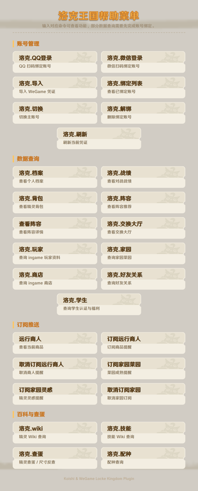
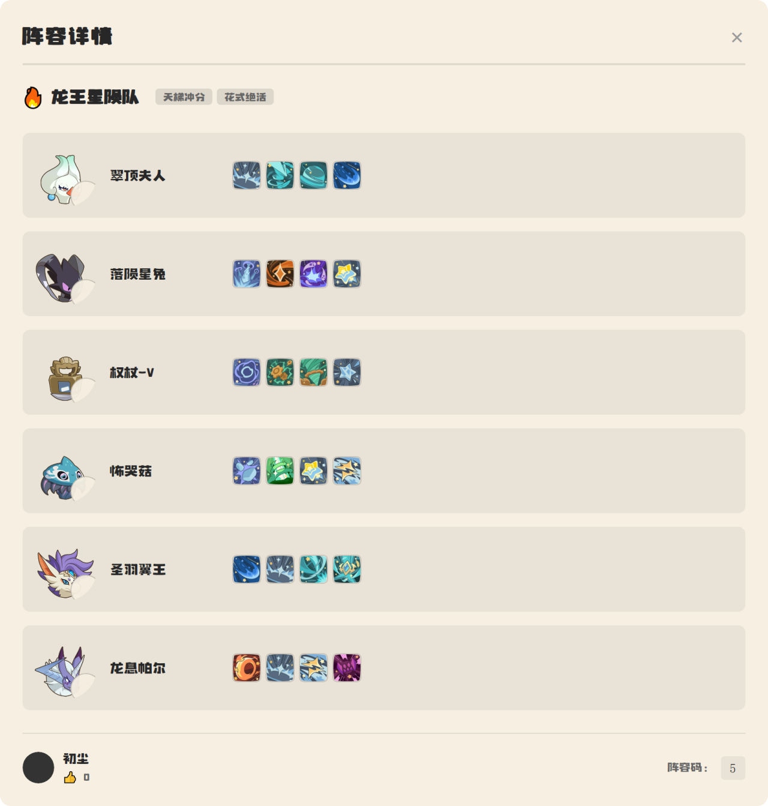
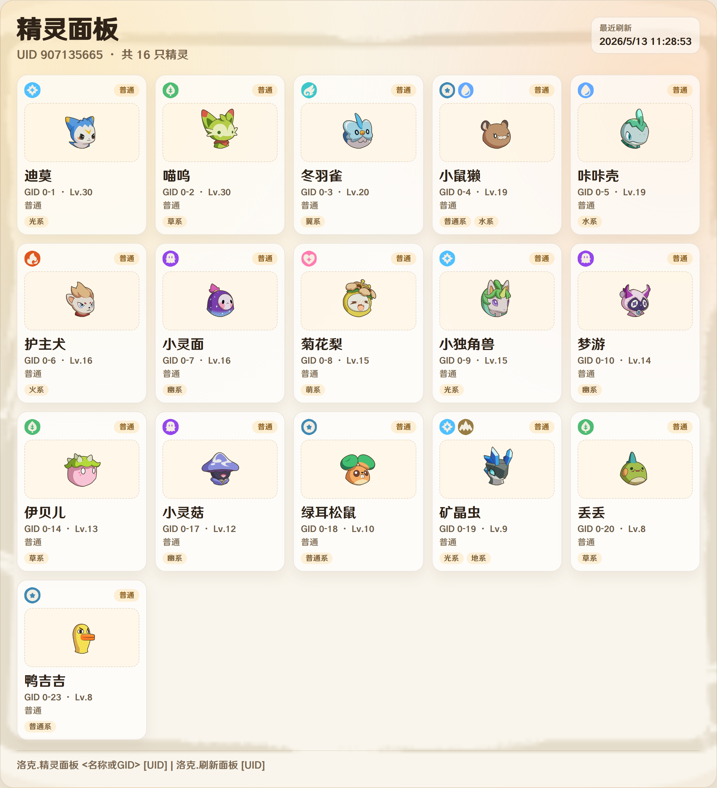
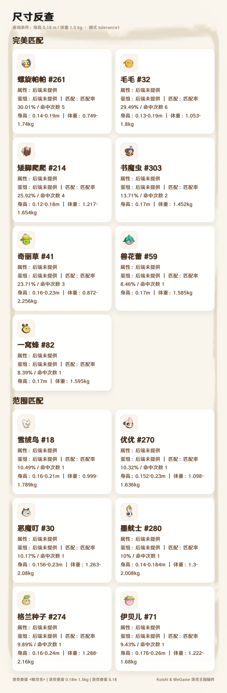

# 指令说明

本文档列出 `koishi-plugin-rocom` 的全部可用指令，包括帮助菜单、账号管理、数据查询、远行商人、家园订阅、Wiki、查蛋配种以及管理命令。

> 返回 [README](../readme.md)

## 目录

- [帮助菜单](#帮助菜单)
- [账号管理](#账号管理)
- [数据查询](#数据查询)
- [活动与公告](#活动与公告)
- [远行商人](#远行商人)
- [家园订阅](#家园订阅)
- [Wiki 查询](#wiki-查询)
- [查蛋配种](#查蛋配种)
- [管理命令](#管理命令)

## 帮助菜单

### `洛克`

查看插件内置帮助菜单，列出常用账号管理、数据查询和百科/查蛋命令。

```text
洛克
```



## 账号管理

大部分游戏数据查询功能需要先绑定洛克王国账号。查蛋、配种等本地数据功能无需登录。

### `洛克.QQ登录`

生成 QQ 扫码登录二维码。扫码成功后插件会自动创建绑定，并保存当前用户的主账号凭证。

```text
洛克.QQ登录
```

注意事项：

- 二维码有效时间约 2 分钟。
- 需要双设备扫码。
- QQ 扫码绑定支持后续刷新凭证。


### `洛克.微信登录`

生成微信扫码登录链接。扫码成功后插件会自动创建绑定并保存账号。

```text
洛克.微信登录
```

注意事项：

- 链接有效时间约 2 分钟。
- 需要双设备扫码。


### `洛克.导入 <tgp_id> <tgp_ticket>`

手动导入 WeGame 凭证，适用于已有 `tgp_id` 和 `tgp_ticket` 的场景。

```text
洛克.导入 你的tgp_id 你的tgp_ticket
```


### `洛克.绑定列表`

查看当前用户已经绑定的账号列表，并以图片面板展示。主账号会标记为“主账号”；如果图片渲染失败，会回退为文本列表。

```text
洛克.绑定列表
```


### `洛克.切换 <序号>`

切换当前用户的主账号。序号来自 `洛克.绑定列表`。

```text
洛克.切换 2
```


### `洛克.解绑 <序号>`

解绑指定序号的账号，并尝试删除服务端绑定记录。

```text
洛克.解绑 1
```


### `洛克.刷新`

刷新当前主账号凭证。当前实现主要适用于 QQ 扫码绑定的账号。

```text
洛克.刷新
```

### `洛克.绑定UID <UID>`

使用洛克王国世界 UID 创建账号绑定记录。适用于只知道角色 UID、希望后续 `洛克.家园`、`洛克.刷新面板`、`洛克.精灵面板` 默认使用该 UID 的场景。

```text
洛克.绑定UID 12345678
绑定UID 12345678
```

说明：

- UID 必须是 `4` 到 `20` 位数字。
- 如果后端返回 `frameworkToken`，插件会同步保存凭证；否则会保存为本地主账号 UID。
- 重复绑定同一 UID 时，会替换旧的本地记录并设为主账号。


## 数据查询

以下功能需要先绑定账号。如果凭证过期，请重新登录或使用 `洛克.刷新`。

### `洛克.档案`

生成个人档案卡片，展示角色基础信息、评分、收藏、AI 点评、雷达图、近期战绩和部分玩家扩展资料。

```text
洛克.档案
```


### `洛克.战绩 [页码]`

查看对战战绩概览和近期战斗记录。

```text
洛克.战绩
洛克.战绩 2
```


### `洛克.背包 [分类] [页码]`

查看精灵背包。支持按分类筛选，也支持翻页。

可用分类：

- `全部`
- `了不起`
- `异色`
- `炫彩`

示例：

```text
洛克.背包
洛克.背包 异色
洛克.背包 炫彩 2
洛克.背包 了不起精灵 3
```


### `洛克.阵容 [分类] [页码]`

查看阵容推荐列表。参数可用来指定分类或页码。

```text
洛克.阵容
洛克.阵容 热门 2
洛克.阵容 PVP
```


### `查看阵容 <阵容码>`

查看指定阵容的详情，包括阵容名称、标签、作者、精灵、技能和血脉信息。

示例：

```text
查看阵容 123456
```



### `洛克.交换大厅 [页码]`

查看玩家交换大厅帖子。支持翻页。

示例：

```text
洛克.交换大厅
洛克.交换大厅 2
```

### `洛克.刷新面板 [uid]`

刷新指定账号的精灵面板缓存。  
不传 `uid` 时，会优先使用当前会话绑定的主账号 UID。

```text
洛克.刷新面板
洛克.刷新面板 12345678
```

说明：

- 当后端 `ingame` 查询可用时，会优先拉取更完整的家园精灵数据。
- 若当前环境缺少 API 凭证，会自动尝试使用已登录账号的精灵背包数据进行回退刷新。
- 刷新成功后可继续使用 `洛克.精灵面板` 查询详情。

### `洛克.精灵面板 [名称或GID] [uid]`

查询精灵面板详情，支持按精灵名称或 `GID` 查询。  
不传 `名称或GID` 时，会直接显示当前账号的精灵列表面板。

```text
洛克.精灵面板
洛克.精灵面板 火神
洛克.精灵面板 12345678
洛克.精灵面板 火神 12345678
```

说明：

- `GID` 是单只精灵实例的唯一编号；同名精灵较多时建议优先使用 `GID`。
- 命中多个候选时，插件会提示你回复序号选择目标精灵。
- 图片渲染失败时，会自动回退为文本列表/文本详情。



## 活动与公告

### `洛克.日历 [刷新]`

查看 RoCom 活动日历。默认读取后端缓存；传入 `刷新` 时会请求后端强制刷新缓存，是否成功取决于当前 API Key 权限。

```text
洛克.日历
洛克.日历 刷新
```

优先以图片日历展示活动名称、起止时间、状态、说明和奖励摘要；图片渲染或发送失败时，会自动回退为文本列表。

### `洛克.公告 [页码]`

查看 RoCom 公告列表。默认查询全部分类聚合页。

```text
洛克.公告
洛克.公告 2
```

### `洛克.最新公告`

查看最新一条 RoCom 公告。

```text
洛克.最新公告
```

### `洛克.公告详情 <公告ID>`

以图片展示指定公告，长正文自动分成多张发送。图片失败时回退完整文字及图片链接，不执行远端 HTML 脚本。

```text
洛克.公告详情 219
```


## 远行商人

### `远行商人`

查看当前远行商人的商品、轮次和剩余时间。当前轮次按每日 `08:00 / 12:00 / 16:00 / 20:00` 计算。

```text
远行商人
```


### `订阅远行商人 [1/0] [商品名... | 全部]`

在群聊中订阅远行商人提醒。群内操作按订阅权限开关允许群主/群管理员、`adminUserIds` 白名单或达到配置 authority 的 Bot 管理员设置；私聊场景支持个人自行订阅（需开启 `merchantPrivateSubscriptionEnabled`）。

参数说明：

- 第一个可选参数 `1` / `0`：仅群聊生效。`1` 表示命中后 @全体成员，`0` 表示不 @全体。省略时默认 `0`。私聊订阅强制为不 @。
- 后续参数为订阅商品名，按"包含关系"与当前商品名做模糊匹配（例如订阅 `国王球` 会命中 `国王球(大)`）。
- 若只传一个特殊关键字 `全部`，则进入 **全部订阅模式**：忽略商品匹配，只要远行商人本轮有在售商品，就把整张远行商人渲染图直接推送给订阅方。每轮（`08:00 / 12:00 / 16:00 / 20:00`）只推一次。
- 不传任何商品名时，使用配置里的 `merchantSubscriptionItems` 作为默认关键词。

查看当前会话的订阅：

```text
查看远行商人订阅
```

常见用法：

```text
订阅远行商人                       # 使用配置中的默认关键词
订阅远行商人 国王球 棱镜球 炫彩精灵蛋   # 按关键词匹配
订阅远行商人 1 国王球              # 命中后 @全体
订阅远行商人 全部                   # 每轮直接推送整张商人图
订阅远行商人 1 全部                 # 每轮推送并 @全体
```

按关键词订阅时，去重规则是"同一轮次 + 同一匹配商品集合"只推一次；全部订阅模式下仅按轮次去重，本轮推过就不再重复。


### `取消订阅远行商人`

取消当前群聊的远行商人订阅。群内操作遵循统一订阅权限开关；私聊场景可自行取消个人订阅。

```text
取消订阅远行商人
```


## 家园订阅


### `订阅家园菜园 [uid]`

订阅指定 UID 的家园菜园成熟提醒。私聊场景可自行订阅；群聊场景遵循统一订阅权限开关，默认允许群管理员及 Bot 管理员设置。

```text
订阅家园菜园
订阅家园菜园 12345678
```

不传 `uid` 时，会优先使用你当前绑定账号的 UID。

### `订阅家园灵感 [uid]`

订阅指定 UID 的家园精灵灵感完成提醒。私聊场景可自行订阅；群聊场景遵循统一订阅权限开关，默认允许群管理员及 Bot 管理员设置。

```text
订阅家园灵感
订阅家园灵感 12345678
```

不传 `uid` 时，会优先使用你当前绑定账号的 UID。

### `取消订阅家园 [kind] [uid]`

取消当前会话的家园订阅。私聊场景可自行取消；群聊场景遵循统一订阅权限开关。

```text
取消订阅家园
取消订阅家园 菜园
取消订阅家园 灵感 12345678
```

## Wiki 查询

### `洛克.wiki <精灵名>`

Wiki 全局/分类查询，支持按目录检索精灵、道具等项目，不需要登录账号。

```text
洛克.wiki 喵喵
```


### `洛克.技能 <技能名>`

技能 Wiki 查询，返回技能效果与可学习该技能的精灵，不需要登录账号。

```text
洛克.技能 火花
```


## 查蛋配种

查蛋优先使用后端 Egg API，接口失败时回退 Wiki 和本地 `Pets.json`，成功但无匹配时直接显示无结果。配种规则仍由本地引擎提供，不需要登录账号。

### `洛克.查蛋 <精灵名>`

查询指定精灵的蛋组、性别比、身高体重范围、种族值、同蛋组可配种精灵等信息。名称查询优先调用 `/egg/pet-groups` 和 `/egg/group-pets`，不可用时回退 Wiki / 本地数据。总量取后端合并蛋组统计，无法获取时明确显示当前预览数量。

示例：

```text
洛克.查蛋 喵喵
```

匹配规则：

- 精确命中时直接展示查蛋结果。
- 模糊命中一个结果时会提示模糊匹配。
- 命中多个结果时会展示候选列表。



### `洛克.查蛋 <身高> [体重]`

按尺寸反查精灵。身高使用游戏原生单位 `m`，体重使用 `kg`。同时提供身高和体重时，优先调用 `/egg/search`，失败后依次回退 `/wiki/pet-size/query` 和本地数据。图片与文字都展示小块头/大块头标记；缺失体重范围时不作判定。

示例：

```text
洛克.查蛋 0.18
洛克.查蛋 0.18 1.5
洛克.查蛋 0.18m 1.5kg
洛克.查蛋 身高0.18m 体重1.5kg
```


### 查蛋候选结果

当精灵名称命中多个候选时，插件会展示候选列表。请根据候选列表使用更精确的名称重新查询。


### `洛克.配种 <精灵名>`

查询想要孵出某个目标精灵时，可以选择哪些父体。默认孵蛋结果跟随母体，所以目标精灵会作为母体展示。

适合在你已经确定“目标宝宝”时使用。例如想孵出喵喵，就只需要输入目标精灵名，插件会返回可用于配种的父体方案。

示例：

```text
洛克.配种 喵喵
```

返回内容通常包括：

- 目标精灵信息
- 可选父体列表
- 相关蛋组
- 孵化时间
- 身高体重范围


### `洛克.配种 <父体> <母体>`

判断两只精灵是否可以配种。默认前一个参数为父体，后一个参数为母体，孵蛋结果跟随母体。

参数顺序很重要：

- 第一个参数：父体
- 第二个参数：母体
- 孵蛋结果：跟随母体

```text
洛克.配种 父体名称 母体名称
```

示例：

```text
洛克.配种 喵喵 火花
```

返回内容包括：

- 是否可以配种
- 共享蛋组
- 无法配种原因
- 孵化时长
- 身高体重范围

常见用法：

- 只输入一个精灵名：查询“怎样孵出这个精灵”
- 输入两个精灵名：判断“这两只精灵能不能配”
- 名称命中多个候选时：插件会返回候选列表，请换成更精确的精灵名重新查询

## 管理命令

管理命令仅允许 `adminUserIds` 中配置的用户使用。

### `洛克.同步配置`

手动触发后端 RoCom 配置同步，对应 `/api/v1/games/rocom/config/sync`。该接口还需要后端 API Key 具备 `admin.access` 权限。

```text
洛克.同步配置
```

### `洛克.刷新所有凭证`

批量刷新所有用户的主账号凭证。仅支持可刷新的 QQ 扫码绑定账号。

```text
洛克.刷新所有凭证
```


### `洛克.删除失效绑定`

检查所有用户绑定的有效性，移除失效绑定，并清理对应本地凭证。

```text
洛克.删除失效绑定
```


### 自动刷新凭证

开启 `autoRefreshEnabled` 后，插件会按 `autoRefreshTime` 配置的时间点自动刷新所有可刷新的 QQ 绑定账号。

推荐配置示例：

```yaml
autoRefreshEnabled: true
autoRefreshTime:
  - "00:00"
  - "12:00"
```

## 排行榜

异色/炫彩精灵收集排行榜，不需要登录游戏账号即可查询公共榜；绑定账号后可不带 UID 查询自己的名次。

### `异色排行榜 [UID] [数量]`

### `炫彩排行榜 [UID] [数量]`

- 数量支持 1–50，默认 10。
- 只填一个 1–50 的数字时视为数量；其他纯数字视为 UID。
- UID 以字符串传递，不会与数量混淆。

```text
异色排行榜
炫彩排行榜 10
异色排行榜 12345678 20
```

别名：`异色榜`、`炫彩榜`、`洛克异色排行榜`、`洛克炫彩排行榜`。

## 阵容分享码

### `阵容码 解析 <分享码或链接>`

解析原始分享码或包含 `shareData` 参数的链接，不需要游戏绑定。

```text
阵容码 解析 ABCDEF==
阵容码 解析 https://example.com/page?shareData=ABCDEF%3D%3D
```

### `阵容码 查询 <分享码>`

查询该分享码的解析历史记录。若没有记录，请先执行 `阵容码 解析`。

```text
阵容码 查询 ABCDEF==
```

别名：`阵容码解析`、`阵容码查询`。

> 查询缺解析对象时，插件可能重新调用一次解析接口补齐展示，因此查询可能增加后端解析计数。


## 新版查询和订阅补充

### 玩家、家园与商店

- `洛克.玩家 [UID]`：支持新版嵌套玩家资料、名片图、异色和炫彩收集数；不填 UID 时使用主绑定，有凭证时可由后端识别当前角色。
- `洛克.家园 [UID]`：查询家园概览；不填 UID 时使用当前绑定或登录凭证。
- `洛克.家园详情 [UID] [pet_gid] [npc_id]`：查询摆放精灵完整资料，单只查询同时提供后两个参数；长图自动分页。
- `洛克.商店 [shopId]`：默认商店 ID 为 `3009`，兼容实时商品与旧 rows 响应。
- `图鉴下载`、`精灵图鉴 <名称>`：下载和查询本地图鉴，下载操作限 Bot 管理员。

### 订阅行为

- `订阅家园生蛋 [UID]`：首个/全部可领取提醒；`取消订阅家园 生蛋 [UID]` 取消。
- `订阅洛克公告`、`取消订阅洛克公告`：订阅当前会话，之后出现的新公告以图片或文字发送。
- `subscriptionGroupAdminEnabled` 和 `subscriptionBotAdminEnabled` 独立控制三类群订阅；Bot 权限阈值为 `subscriptionBotAdminAuthority`，默认 4。
- 多 Bot 订阅保存当前 Bot 标识；旧订阅缺少标识且同平台有多个 Bot 时需重新订阅，避免发到错误 Bot。
- 商人 `merchantTimezone` 默认 `Asia/Shanghai`；定时模式在指定时刻前后 30 秒检查，空商品最多重试 3 次，每次间隔约 4 分钟。
- 仅发送返回有效消息 ID 后推进去重状态，失败保留重试机会；插件停止时取消在途检查。
- 家园通知展示绑定昵称；新订阅确认是订阅者本人绑定时可在群内 @，查询他人 UID 不自动认定账号所有者。

### 图片与记录查询

排行榜和公告长图会分张发送。玩家、查蛋、分享码在图片失败时回退相应文字内容。分享码历史有记录但缺解析详情时会尝试重新解析，可能增加后端解析次数；重新解析失败会显示错误，不返回空阵容假成功。
